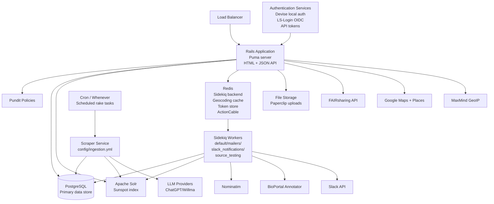
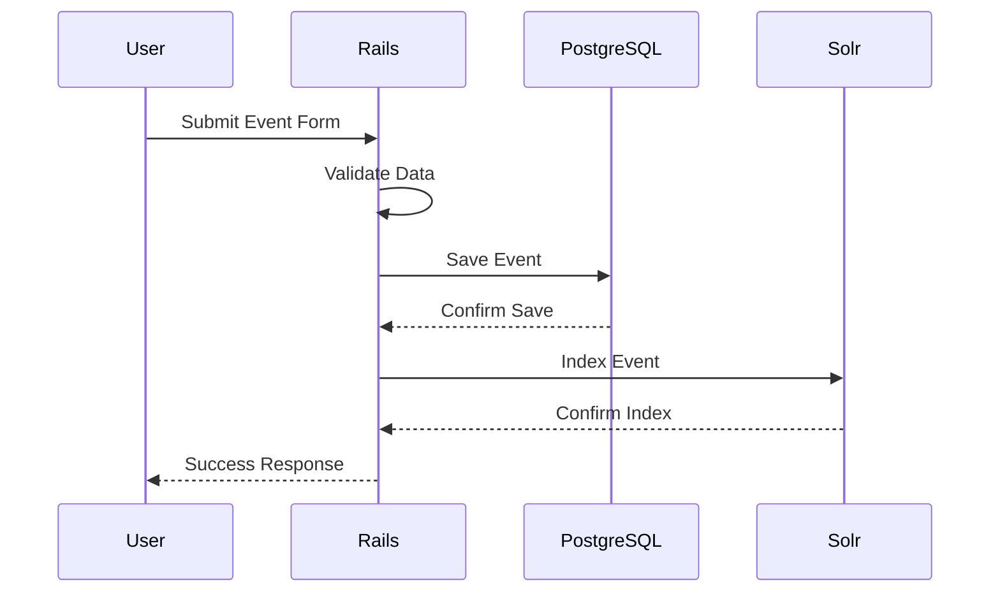
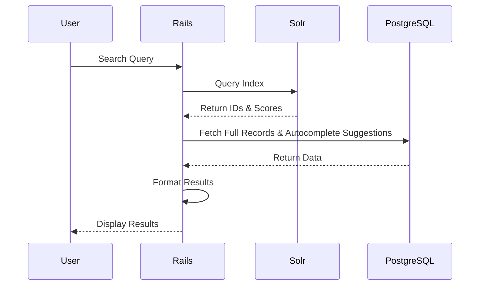
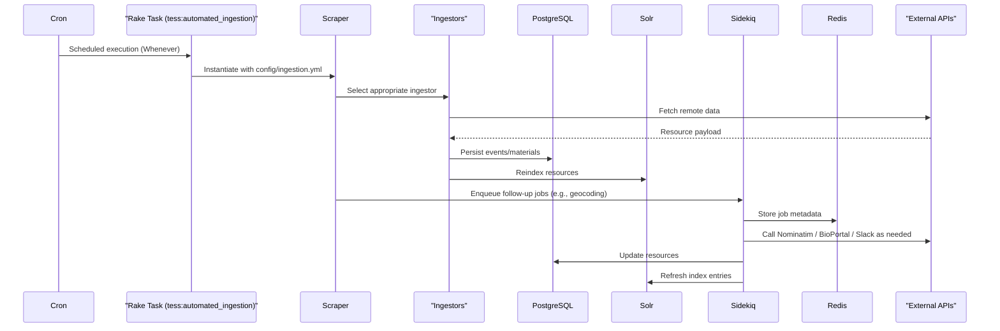

# TeSS Architecture Documentation

## Table of Contents
- [TeSS Architecture Documentation](#tess-architecture-documentation)
  - [Table of Contents](#table-of-contents)
  - [System Overview](#system-overview)
  - [Component Architecture](#component-architecture)
  - [System Components](#system-components)
    - [Core Application](#core-application)
      - [Rails Application](#rails-application)
    - [Data Layer](#data-layer)
      - [PostgreSQL Database](#postgresql-database)
      - [Redis](#redis)
      - [Apache Solr](#apache-solr)
    - [Background Processing](#background-processing)
      - [Sidekiq Workers](#sidekiq-workers)
      - [Scheduled Ingestion (Scraper)](#scheduled-ingestion-scraper)
    - [Authentication & Authorization](#authentication--authorization)
    - [Authentication Flow](#authentication-flow)
    - [Data flow](#data-flow)
    - [Search Flow](#search-flow)
    - [Background Job Processing  Flow](#background-job-processing--flow)

## System Overview

TeSS (Training e-Support Service) is a Ruby on Rails application that provides a portal for discovering and registering training events and materials in the life sciences domain.

## Component Architecture

## System Components

### Core Application

#### Rails Application

The main application server built with Ruby on Rails framework, running on Puma web server.

- **Port**: 3000
- **Endpoints**: Web UI and RESTful JSON API
- **Scaling**: Supports horizontal scaling with multiple instances behind load balancer
- **Configuration**: Managed through `config/application.rb` and environment-specific settings

### Data Layer

#### PostgreSQL Database

Primary relational database system for persistent data storage.

- **Stores**: user accounts, role assignments, Rails resources (events, materials, content providers, learning paths, workflows), autocomplete suggestions, audit activities, and ingestion logs.
- **Connection Pool**: configured via `config/database.yml`.

#### Redis

In-memory key-value store used for non-persistent operational state.

- **Functions**:
  - Sidekiq job backend (`config/sidekiq.yml`)
  - Geocoding cache for Event coordinates (`app/models/event.rb`)
  - Source test job bookkeeping (`app/models/concerns/has_test_job.rb`)
  - FAIRsharing API token caching (`lib/fairsharing/client.rb`)
  - ActionCable production adapter (`config/cable.yml`)
- **Configuration**: dynamic via `TeSS::Config.redis_url` (`config/application.rb`).

#### Apache Solr

Enterprise search platform for full-text search capabilities.

- **Features**:
  - Full-text search indexing
  - Faceted search and filtering
  - Autocomplete suggestions
- **Integration**: Sunspot Rails gem
- **Configuration**: `config/sunspot.yml`

### Background Processing

#### Sidekiq Workers

Asynchronous job processing system used for tasks that must not block web requests.

- **Adapter**: configured via `config/initializers/sidekiq.rb` with `sidekiq-status` support.
- **Queues**: `default`, `mailers`, `slack_notifications`, `source_testing` (`config/sidekiq.yml`).
- **Representative jobs**:
  - `GeocodingWorker` – resolves event coordinates using Redis-backed caching (`app/workers/geocoding_worker.rb`).
  - `EditSuggestionWorker` – fetches BioPortal annotations for curation support (`app/workers/edit_suggestion_worker.rb`).
  - `SourceTestWorker` – dry-runs ingestion sources via Sidekiq::Status (`app/workers/source_test_worker.rb`).
  - `SlackNotificationJob` – ActiveJob wrapper for production-only Slack alerts (`app/jobs/slack_notification_job.rb`).
- **Scheduling**: queues are fed either by user-triggered actions (e.g., Source testing) or by rake tasks executed via cron (see below).

#### Scheduled Ingestion (Scraper)

- **Coordinator**: `lib/scraper.rb` orchestrated by `rake tess:automated_ingestion` (`lib/tasks/tess.rake`).
- **Trigger**: Cron entries generated by Whenever (`config/schedule.rb`).
- **Configuration**: Combines defaults from `lib/scraper.rb` (username, role, logging) with overrides in `config/ingestion.yml` (via `TeSS::Config.ingestion`) and approved database `Source` records (`lib/scraper.rb:68-71`).
- **Flow**: instantiates `Scraper::ConfigSource` and persisted `Source` records, runs the appropriate ingestors, persists Events/Materials, and refreshes the Solr index.
- **More detail**: See `docs/architecture-deep-dive.md#scheduled-maintenance` for the full job schedule and follow-up processing.

### Authentication & Authorization

- **Devise** handles local authentication, confirmations, invitations, password recovery, and tracks sign-ins (`app/models/user.rb`).
- **OmniAuth Providers** (OpenID Connect) enable federated login:
  - **LS-Login / Life Science AAI** (`config/initializers/omniauth/ls_login.rb`)
  - **AAF** – Australian Access Federation (`config/initializers/omniauth/aaf.rb`)
  - **Tuakiri** – New Zealand Tuakiri AAI (`config/initializers/omniauth/tuakiri.rb`)
- **Token Authentication** via `acts_as_token_authentication_handler_for` exposes API access using per-user tokens (`app/controllers/application_controller.rb:15`).
- **Pundit** policies authorize per-resource access using `Pundit::CurrentContext` to include request metadata (`app/controllers/application_controller.rb:28`).

For implementation nuances (LLM enrichment, model concerns, troubleshooting), refer to the companion guide in `docs/architecture-deep-dive.md`.

### Authentication Flow

### Data flow

### Search Flow

> **Note:** Autocomplete suggestions are stored in the `autocomplete_suggestions` table and maintained via the `AutocompleteManager` concern rather than being sourced from Solr facets.

### Background Job Processing  Flow

