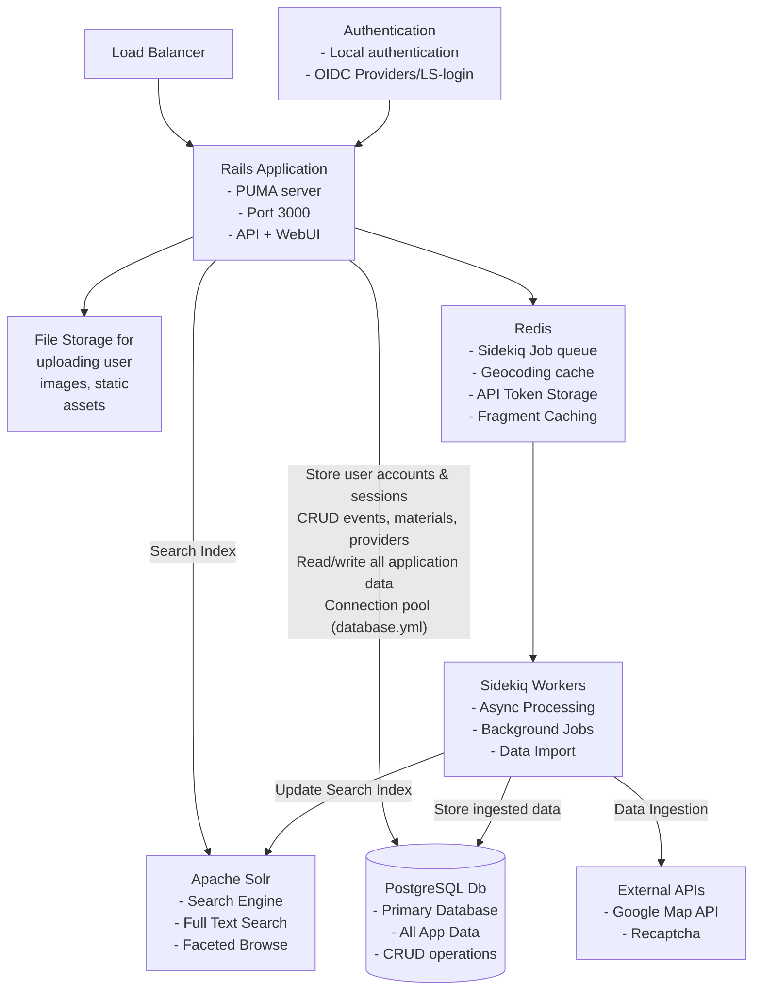
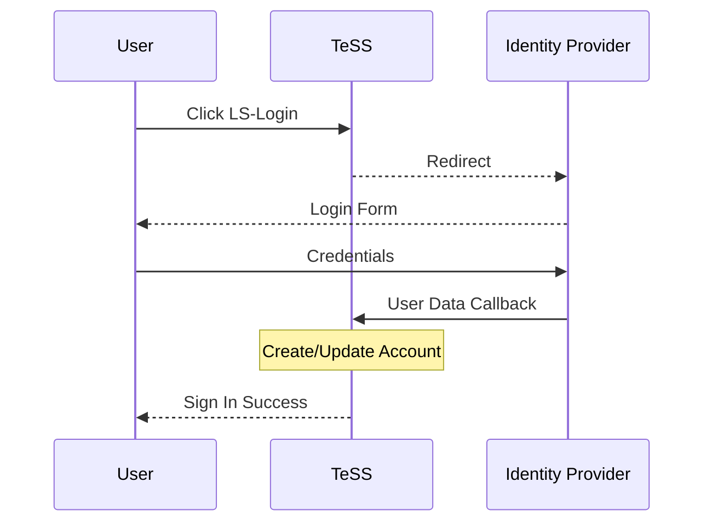
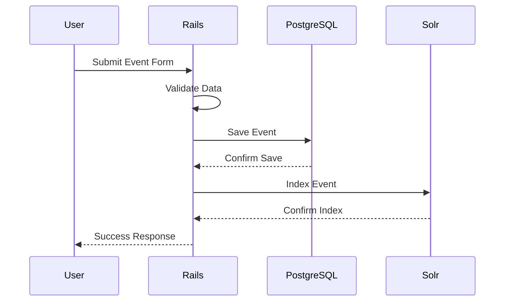
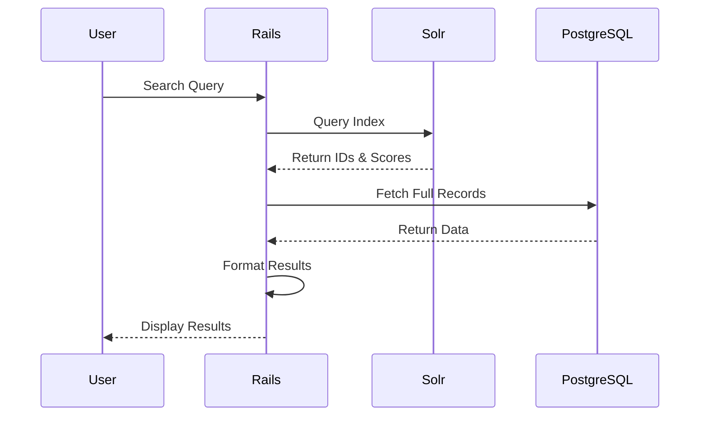
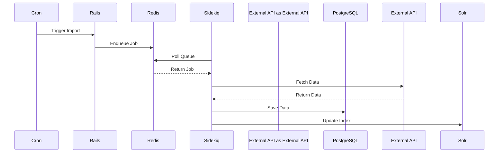

# TeSS Architecture Documentation

## Table of Contents
- [TeSS Architecture Documentation](#tess-architecture-documentation)
  - [Table of Contents](#table-of-contents)
  - [System Overview](#system-overview)
  - [Component Architecture](#component-architecture)
  - [System Components](#system-components)
    - [Core Application](#core-application)
      - [Rails Application](#rails-application)
    - [Data Layer](#data-layer)
      - [PostgreSQL Database](#postgresql-database)
      - [Redis](#redis)
      - [Apache Solr](#apache-solr)
    - [Background Processing](#background-processing)
      - [Sidekiq Workers](#sidekiq-workers)
    - [Authentication Flow](#authentication-flow)
    - [Data flow](#data-flow)
    - [Search Flow](#search-flow)
    - [Background Job Processing  Flow](#background-job-processing--flow)

## System Overview

TeSS (Training e-Support Service) is a Ruby on Rails application that provides a portal for discovering and registering training events and materials in the life sciences domain.

## Component Architecture

## System Components

### Core Application

#### Rails Application

The main application server built with Ruby on Rails framework, running on Puma web server.

- **Port**: 3000
- **Endpoints**: Web UI and RESTful JSON API
- **Scaling**: Supports horizontal scaling with multiple instances behind load balancer
- **Configuration**: Managed through `config/application.rb` and environment-specific settings

### Data Layer

#### PostgreSQL Database

Primary relational database system for persistent data storage.

- **Stores**: 
  - User accounts and authentication data
  - Training events and materials
  - Content provider information
  - Application sessions
- **Connection Pool**: Configured via `database.yml`

#### Redis

In-memory key-value store for high-performance operations.

- **Primary Function**: Sidekiq job queue backend
- **Secondary Functions**:
  - Geocoding results cache
  - API token storage
  - Fragment caching
- **Configuration**: Set via `REDIS_URL` environment variable

#### Apache Solr

Enterprise search platform for full-text search capabilities.

- **Features**:
  - Full-text search indexing
  - Faceted search and filtering
  - Autocomplete suggestions
- **Integration**: Sunspot Rails gem
- **Configuration**: `config/sunspot.yml`

### Background Processing

#### Sidekiq Workers

Asynchronous job processing system for background tasks.

- **Concurrency**: Configurable worker threads
- **Job Types**:
  - Data import from external sources
  - Geocoding via Nominatim API
  - Email notifications
  - Search index updates
  
- **Queue Priority**:
  1. `critical` - Time-sensitive operations
  2. `default` - Standard background jobs
  3. `mailers` - Email delivery
  4. `imports` - External data ingestion
  5. `geocoding` - Location processing

### Authentication Flow

### Data flow

### Search Flow

### Background Job Processing  Flow

